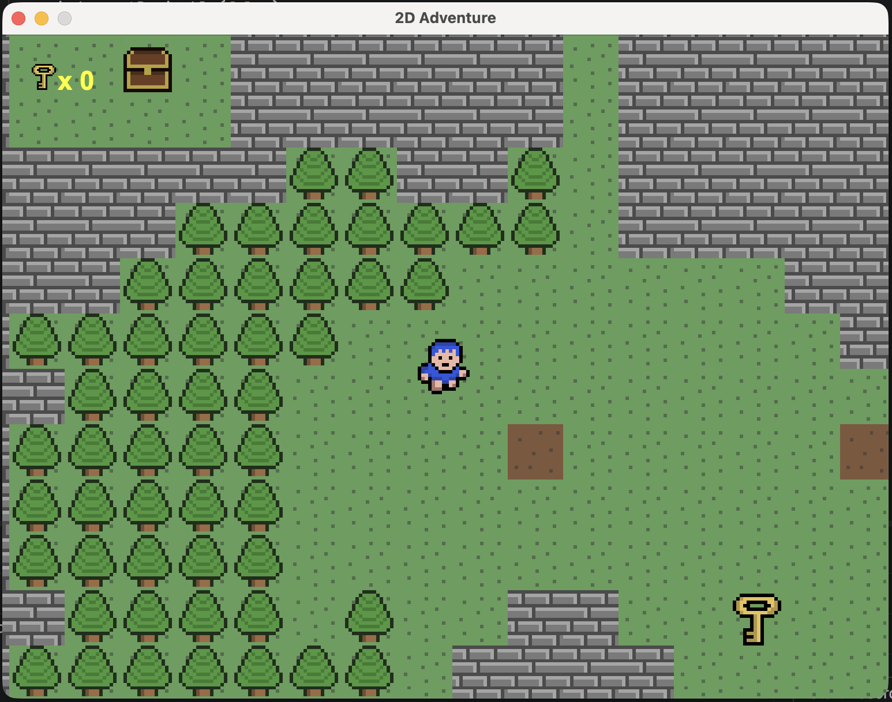
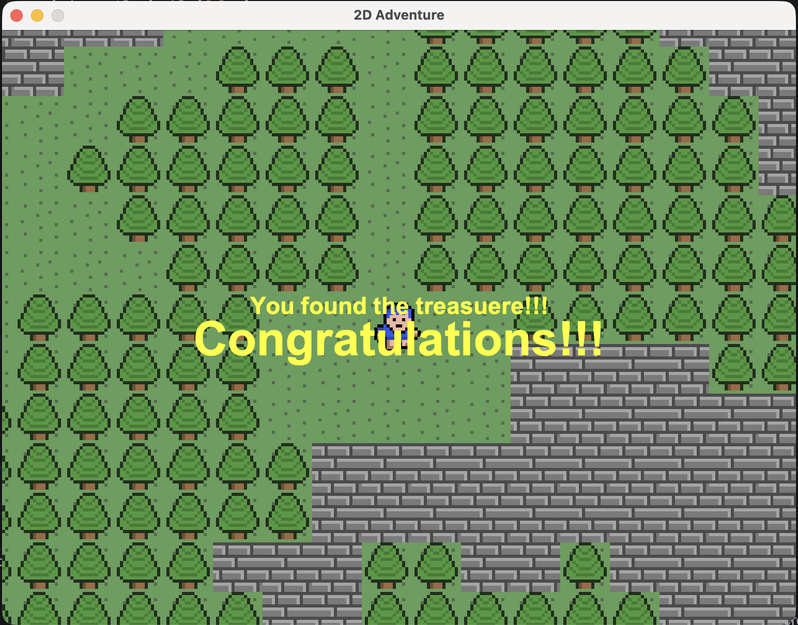
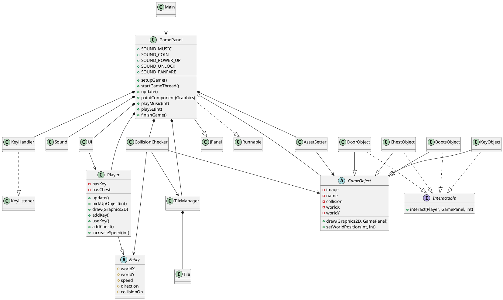
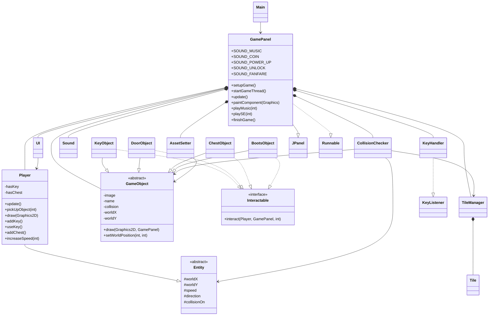

# 2D Adventure

## Overview

2D Adventure is a Java Swing tile-based adventure game created for an Object-Oriented Programming (OOP) course. The player explores a large 100 x 100 tile world, collects keys, opens doors, picks up speed boots, and collects three treasure chests. The game ends with a congratulations screen after all three treasure boxes are collected.

## Features

- Tile-based 2D world loaded from `res/maps/world_map.txt`.
- Keyboard-controlled player movement using W, A, S, and D.
- Animated player sprite with separate images for up, down, left, and right movement.
- Collision detection for solid map tiles such as walls, water, and trees.
- Collectible keys that increase the key counter shown in the UI.
- Doors that require keys to open.
- Speed boots that increase player movement speed.
- Three treasure chests placed in the world.
- Game completion after collecting all three treasure chests.
- Sound effects for collecting items, unlocking doors, powering up, and finishing the game.
- Background music during gameplay.
- Simple HUD showing the current key count.
- Temporary UI messages for gameplay events.

## Screenshots

### Gameplay



### Treasure Completion



## Technologies Used

- Java
- Java Swing
- Java AWT
- Java Sound API (`javax.sound.sampled`)
- PNG image assets
- WAV audio assets
- Text-based tile maps
- Git for version control

## Project Structure

```text
GameProject/
├── src/
│   ├── entity/
│   │   ├── Entity.java
│   │   └── Player.java
│   ├── main/
│   │   ├── AssetSetter.java
│   │   ├── CollisionChecker.java
│   │   ├── GamePanel.java
│   │   ├── KeyHandler.java
│   │   ├── Main.java
│   │   ├── Sound.java
│   │   └── UI.java
│   ├── object/
│   │   ├── BootsObject.java
│   │   ├── ChestObject.java
│   │   ├── DoorObject.java
│   │   ├── GameObject.java
│   │   ├── Interactable.java
│   │   └── KeyObject.java
│   └── tile/
│       ├── Tile.java
│       └── TileManager.java
├── res/
│   ├── maps/
│   │   ├── map01.txt
│   │   └── world_map.txt
│   ├── objects/
│   │   ├── boots.png
│   │   ├── chest.png
│   │   ├── door.png
│   │   └── key.png
│   ├── player/
│   │   ├── boy_down_1.png
│   │   ├── boy_down_2.png
│   │   ├── boy_left_1.png
│   │   ├── boy_left_2.png
│   │   ├── boy_right_1.png
│   │   ├── boy_right_2.png
│   │   ├── boy_up_1.png
│   │   └── boy_up_2.png
│   ├── sound/
│   │   ├── BlueBoyAdventure.wav
│   │   ├── coin.wav
│   │   ├── fanfare.wav
│   │   ├── powerup.wav
│   │   └── unlock.wav
│   └── tiles/
│       ├── earth.png
│       ├── grass.png
│       ├── sand.png
│       ├── tree.png
│       ├── wall.png
│       └── water.png
└── GameProject.iml
```

## Installation

1. Install JDK 8 or newer.
2. Clone the repository:

```bash
git clone <repository-url>
cd GameProject
```

3. Open the project in IntelliJ IDEA or another Java IDE.
4. Ensure the `res` directory is available on the runtime classpath.

## Running the Project

### From IntelliJ IDEA

1. Open the project folder.
2. Mark `src` as the source root if the IDE does not detect it automatically.
3. Ensure `res` is included as a resource/classpath directory.
4. Run `main.Main`.

### From Terminal

Compile:

```bash
javac -cp res -d out/production/GameProject $(find src -name '*.java')
```

Run:

```bash
java -cp out/production/GameProject:res main.Main
```

On Windows, use `;` instead of `:` in the classpath:

```bash
java -cp out/production/GameProject;res main.Main
```

## Controls

| Key | Action |
|---|---|
| W | Move up |
| A | Move left |
| S | Move down |
| D | Move right |

## OOP Concepts Demonstrated

### Encapsulation

Encapsulation is used to protect internal state and expose controlled methods.

- `GamePanel` keeps core fields such as `player`, `tileM`, `sound`, `ui`, and object storage private.
- `Player` keeps inventory state private through `hasKey` and `hasChest`, and exposes methods such as `addKey()`, `useKey()`, `getKeyCount()`, `addChest()`, and `getChestCount()`.
- `KeyHandler` stores key state privately and exposes `isUpPressed()`, `isDownPressed()`, `isLeftPressed()`, and `isRightPressed()`.
- `Tile` stores image and collision state privately with getters and setters.
- `GameObject` stores object image, name, position, collision state, and solid area through controlled accessors.

### Abstraction

Abstraction is used to represent shared game concepts.

- `Entity` is an abstract base class for movable game entities. It stores shared properties such as world position, speed, direction, sprite state, and collision area.
- `GameObject` is an abstract base class for world objects such as keys, doors, chests, and boots. It provides common rendering, position, collision, and image-loading behavior.
- `TileManager` abstracts tile image loading, map loading, and tile rendering.
- `CollisionChecker` abstracts collision detection between entities, tiles, and objects.
- `Sound` abstracts audio file loading, playback, looping, and stopping.

### Inheritance

Inheritance is used for shared behavior and specialization.

- `Player extends Entity`, reusing shared entity state while adding player movement, animation, inventory, and interaction handling.
- `KeyObject`, `DoorObject`, `ChestObject`, and `BootsObject` extend `GameObject`, reusing shared object rendering and positioning behavior.
- `GamePanel extends JPanel`, allowing the game to render through Swing's `paintComponent(Graphics g)`.

### Interface Usage

The `Interactable` interface defines a common interaction contract:

```java
void interact(Player player, GamePanel gp, int objectIndex);
```

Implemented by:

- `KeyObject`
- `DoorObject`
- `ChestObject`
- `BootsObject`

Each object class provides its own interaction behavior while following the same interface.

### Polymorphism

Polymorphism is demonstrated through the object interaction system.

- `GamePanel` stores world objects as `GameObject`.
- Different object subclasses are placed in the same object collection.
- `Player.pickUpObject()` checks whether a `GameObject` is an `Interactable` and calls `interact()`.
- The actual behavior depends on the runtime object type:
  - `KeyObject` adds a key.
  - `DoorObject` opens only if the player has a key.
  - `BootsObject` increases movement speed.
  - `ChestObject` increments treasure progress and finishes the game after three chests.

This replaces string-based object handling with polymorphic behavior.

## UML Diagram

### PlantUML Class Diagram



### Mermaid Class Diagram



## Design Decisions

- The project uses a simple package structure suitable for an undergraduate OOP project: `main`, `entity`, `object`, and `tile`.
- `GamePanel` is the central game coordinator because it owns the game loop, rendering order, player, managers, and object collection.
- Rendering is layered in a predictable order: tiles, objects, player, and UI.
- `TileManager` handles map loading and tile rendering separately from player logic.
- `CollisionChecker` keeps collision rules outside the player class.
- `GameObject` centralizes common object rendering, image loading, position, and collision data.
- `Interactable` allows each object type to define its own behavior without requiring `Player` to know every object rule.
- `AssetSetter` keeps object placement in one class, making the map setup easier to understand.

## Code Quality Improvements

- Introduced the `Interactable` interface for object interaction behavior.
- Renamed tutorial-style object classes to Java convention names:
  - `OBJ_Key` to `KeyObject`
  - `OBJ_Door` to `DoorObject`
  - `OBJ_Chest` to `ChestObject`
  - `OBJ_Boots` to `BootsObject`
  - `SuperObject` to `GameObject`
- Improved encapsulation by changing many public fields to private or protected.
- Added getters and controlled methods where external access is required.
- Moved object-specific behavior from `Player` into the object classes.
- Replaced string-based object interaction checks with polymorphic interface calls.
- Added sound constants in `GamePanel` for clearer audio usage.
- Encapsulated tile image and collision state in `Tile`.
- Encapsulated key input state in `KeyHandler`.
- Kept gameplay behavior unchanged while improving class responsibilities.

## Author

Km Abdul Alim Shahin  
Software Engineering  
Shahjalal University of Science and Technology (SUST)
